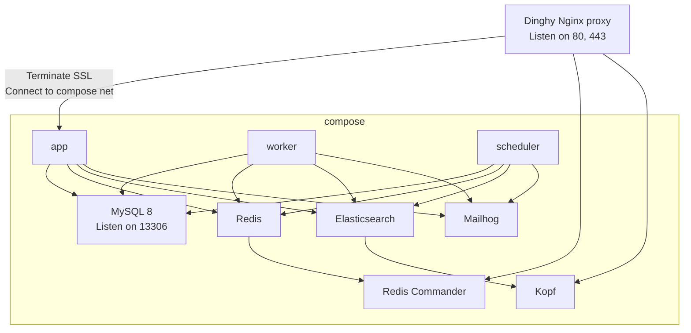

# Taste-Visualization
Shopware 6 Plugin

dieses Plugin  „OdsDeactivateShoppingFunctions“, bietet Ihnen die Möglichkeit, Ihrem Kunden Geschmack der Wein direkt im Store anzusehen.
Füge den Produktdetails einen Tab mit visualisierten Informationen zu die geschmacklichen Nuancen 

#  Shopware 6 infrastructure

## System requirements

The requirements mentioned will be checked by a script if you try to start this environment.

* [Docker](https://docs.docker.com/engine/install/)
* [Docker compose](https://docs.docker.com/compose/install/)
* [Git LFS](https://git-lfs.github.com/)
* [mkcert](https://github.com/FiloSottile/mkcert)
* DNSMasq or other resolution for `*.docker` to `127.0.0.1`
* [Dinghy HTTP Proxy container](https://github.com/codekitchen/dinghy-http-proxy)

## What is included?

* Checking your dev environment
* [Commitlinting](https://commitlint.js.org/#/)
* Code analysis / linting
  * [Psalm](https://psalm.dev/docs/)
  * [Stan](https://phpstan.org/user-guide/getting-started)
  * [ECS](https://github.com/symplify/easy-coding-standard)
  * [PHPMD](https://phpmd.org/documentation/index.html)
  * [Rector](https://github.com/rectorphp/rector)
* SSL generation with [mkcert](https://github.com/FiloSottile/mkcert)
* Git commit hooks
* Backup/Restore mechanism for dumps (using Git LFS)
* Xdebug auto setup
* Mailhog, Elasticsearch, etc.
* Automatic domain and mail settings configuration
* Core fixes
* [Composer patches](https://github.com/symplify/vendor-patches)
* Hot reload through SSL
* E2E Testing with [Playwright](https://playwright.dev/docs/intro/)

