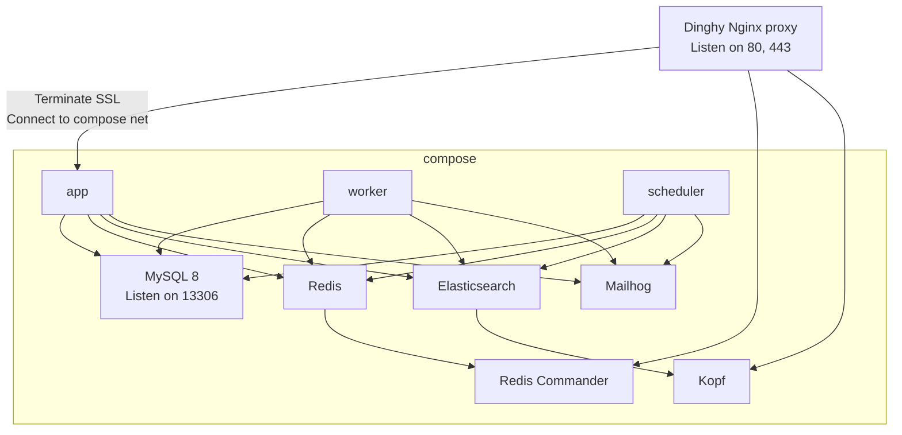

# Taste-Visualization
Shopware 6 Plugin

dieses Plugin  „OdsDeactivateShoppingFunctions“, bietet Ihnen die Möglichkeit, Ihrem Kunden Geschmack der Wein direkt im Store anzusehen.
Füge den Produktdetails einen Tab mit visualisierten Informationen zu die geschmacklichen Nuancen 

#  Shopware 6 infrastructure



## System requirements

The requirements mentioned will be checked by a script if you try to start this environment.

* [Docker](https://docs.docker.com/engine/install/)
* [Docker compose](https://docs.docker.com/compose/install/)
* [Git LFS](https://git-lfs.github.com/)
* [mkcert](https://github.com/FiloSottile/mkcert)
* DNSMasq or other resolution for `*.docker` to `127.0.0.1`
* [Dinghy HTTP Proxy container](https://github.com/codekitchen/dinghy-http-proxy)

## What is included?

* Checking your dev environment
* [Commitlinting](https://commitlint.js.org/#/)
* Code analysis / linting
  * [Psalm](https://psalm.dev/docs/)
  * [Stan](https://phpstan.org/user-guide/getting-started)
  * [ECS](https://github.com/symplify/easy-coding-standard)
  * [PHPMD](https://phpmd.org/documentation/index.html)
  * [Rector](https://github.com/rectorphp/rector)
* SSL generation with [mkcert](https://github.com/FiloSottile/mkcert)
* Git commit hooks
* Backup/Restore mechanism for dumps (using Git LFS)
* Xdebug auto setup
* Mailhog, Elasticsearch, etc.
* Automatic domain and mail settings configuration
* Core fixes
* [Composer patches](https://github.com/symplify/vendor-patches)
* Hot reload through SSL
* E2E Testing with [Playwright](https://playwright.dev/docs/intro/)

Still missing:
* [Sitespeed](https://www.sitespeed.io/)
* Load testing
* Visual regression
* Sentry integration
* Mattermost integration
* Smoke testing with autofixing
* pa11y testing


## Get started

### New Project:
Set `COMPOSE_PROJECT_NAME` in `Makefile` according to project name (URL part of git repo).

Change URL in `docker/etc/nginx/conf.d/10-hot-proxy.conf`.

Change the name of the project in `base.env`.

Generate a token for the shopware composer by logging in to https://account.shopware.com,
selecting a license of the customer and click "install with composer".

*Hint: if you don't see that button, you have insufficient permissions. Talk to a company administrator*

```shell script
make setup
```
(Only execute on initial project setup)

### Existing Project:

```shell script
make restore
```

This command will:
* Start up the containers
* Execute `composer install`
* Install the npm dependencies
* Restore the MySQL dump
* Generate SSL certificate with mkcert and restart http proxy


## Hot reload proxy

**Storefront**

```shell script
make install-build-dependencies
make storefront-watch
open https://sync-proxy.boilerplate.docker # replace project name
```

**Administration**

```shell
make install-build-dependencies
make administration-watch
open https://sync-admin.boilerplate.docker # replace project name
```

## Project code structure

See: https://shyim.me/blog/you-dont-need-a-plugin-to-customize-shopware-6/ 

Our convention:

```shell
custom
├── bundles
│   └── project (the project theme that may extend a composer managed theme and all the must-use project code)
├── plugins  (ignore)
└── static-plugins (plugins that can be turned off by the client)
src
├── Command (commands from the shopware production template plus our additions)
├── DependencyInjection (fixes for the Shopware core regarding Symfony DI)
├── Task (additional maintenance scheduler tasks)
├── Transport (CI workaround for having a synchronous message queue => know when something is finished)
└── Workaround (Shopware core decorations)
```

## Debugging

You can use the following snippet to create an alias `phpdebug` which can trigger Xdebug from CLI commands.

```shell
#!/bin/bash

echo "alias phpdebug='PHP_IDE_CONFIG=\"serverName=app\" php -dxdebug.mode=debug -dxdebug.start_with_request=On -dxdebug.idekey=PHPSTORM -dxdebug.client_host=172.17.0.1'" > ~/.bash_aliases
chmod +x ~/.bash_aliases
source ~/.bash_aliases
```

Usage:  `phpdebug bin/console do:something`

*Note: `172.17.0.1` is the default host IP on Linux, on OSX use `host.docker.internal`*

## Composer patches

You can use the simplify/vendor-patches library
which is integrated into the project.

```shell
# Duplicate the file (duplicate must be called .old)
cp vendor/shopware/elasticsearch/Framework/Indexing/ElasticsearchIndexer.php vendor/shopware/elasticsearch/Framework/Indexing/ElasticsearchIndexer.php.old
# Edit the file
vi vendor/shopware/elasticsearch/Framework/Indexing/ElasticsearchIndexer.php
vendor/bin/vendor-patches generate
```

## Commit message guidelines

Commit messages should look like:

```
fix(api): response encoding

#someticket123
```

For details check our [reference](https://hackmd.1drop.de/p20-clw3RiKdjUs3Uvz8fQ)

## E2E Testing

Inside the hetzner cloud bound to the wildcard domain `*.1drop-ci.dev` will an open 
merge request create a preview environment with the name:

`$CI_COMMIT_REF_SLUG-$CI_PROJECT_PATH_SLUG.1drop-ci.dev`

e.g. https://task-asdf_do-something-onedrop_some-customer.1drop-ci.dev

This URL is publicly available and the E2E Tests will be executed against it.

The environment will remain running until manual termination or at max 1 week.
This should give you enough time to review the feature with the customer.

# TODO: show trace
